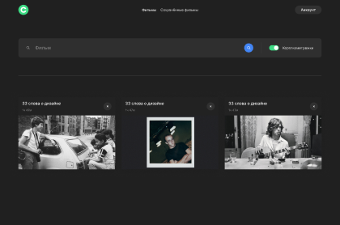

# :clapper: movies-explorer-frontend


## :page_with_curl: Краткое описание:
Это интерактивная SPA-страница, на которой пользователи могут искать фильмы по ключевым словам и добавлять их в избранное в личном кабинете.
Репозиторий проекта Movies, включает фронтенд приложения. Разработан в рамках курса веб-разработки в Яндекс.Практикум и является частью дипломной работы, влючающей еще [back-end](https://github.com/NatalyMaxi/movies-explorer-api) приложения.

Проект реализован по [макету](https://www.figma.com/file/ByLsFozKQQHClNeb6AzMu2/Diploma-Copy) в Figma.

## :ballot_box_with_check: Функциональные возможности проекта:

:ballot_box_with_check: Авторизация и регистрация пользователей;  
:ballot_box_with_check: Загрузка информации о пользователе с сервера;  
:ballot_box_with_check: Редактирование информации о пользователе;  
:ballot_box_with_check: Загрузка фильмов с приложения BeatfilmMoviesApi и сохранение их в локальном хранилице;  
:ballot_box_with_check: Поиск фильмов по ключевому слову среди полученных с BeatfilmMoviesApi;  
:ballot_box_with_check: Поиск фильмов по длительности;  
:ballot_box_with_check: Пагинация при клике на копнку «Ещё»;  
:ballot_box_with_check: Сохранение выбранных фильмов из результов поиска;  
:ballot_box_with_check: Удаление сохраненного фильма(можно удалять только свой);  
:ballot_box_with_check: Валидация форм перед отправкой на сервер;  
:ballot_box_with_check: Прелоадеры с анимацией во время запросов к серверу  


 ### :computer: Стек технологий:

JSX   
CamelCase   
JavaScript   
Promise   
Rest API   
React   
ReactHooks   
CSS3   
Flexbox   
Grid Layout   
Media Queries   
BEM мотодология   
Webpack   
GitHub   
Figma   


### :rocket: Установка и запуск проекта:

```
# клонирование репозитория
git clone https://github.com/NatalyMaxi/movies-explorer-frontend.git

# установка зависимостей
$ npm install

# Запуск сервера
$ npm run start

```
### :link: Ссылки
###### [API](https://api.domainname.nataly.nomoredomains.icu) для регистрации/авторизации и хранения сохраненных фильмов:  
###### [публичное API](https://api.nomoreparties.co/beatfilm-movies) для получения коллекции фильмов BeatFilm:  
###### [Ссылка на репозиторий](https://github.com/NatalyMaxi/movies-explorer-frontend)  
###### [Ссылка на back-end](https://github.com/NatalyMaxi/movies-explorer-api)  


